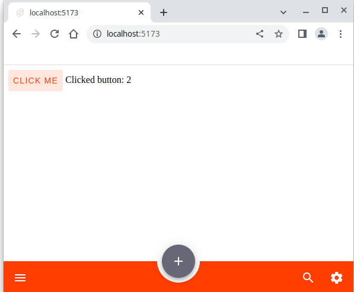

# Introduction

This is a simple example frontend written in [Typescript](https://www.typescriptlang.org/) using [Sveltekit](https://kit.svelte.dev/) in combination with the [Svelte Material UI](https://sveltematerialui.com/).

Compared to the standard Sveltekit application generator it includes Svelte Material UI with some sensible default settings and makes the icons/fonts available directly in the application without the need to fetch them everytime from Google.

The idea is that you simply can take this example and quickly write your application without the need to spend a lot of time on setting it initially up.

Note: Make sure that you have in your path the latest Node.js LTS version available.

You can try out the app on [CodeSandbox](https://codesandbox.io/) and play live with the code: https://codesandbox.io/p/sandbox/sveltekit-and-svelte-material-ui-example-ql6n4e

This is how the demo app looks like in the browser:



You see on the bottom a menu bar with 4 buttons:

- On the left a menu button
- in the middle a create button
- on the right a search and settings button

The main application is a counter. If you click on the button "CLICK ME" it will increase the counter.
The other buttons do not do anything, but it is easy to fill them with "life".

## Code

The code is available under:

- Codeberg (a non-commercial European hosted Git for Open Source): https://codeberg.org/ZuInnoTe/typescript-sveltekit-materialui-example
- Github (an US hosted commercial Git platform): https://github.com/ZuInnoTe/typescript-sveltekit-materialui-example

## License

You can choose to either use [EUPL-1.2](./LICENSE-EUPL-1.2) ([Web](https://spdx.org/licenses/EUPL-1.2.html)) or [Apache-2.0](./LICENSE-Apache-2.0) ([Web](https://spdx.org/licenses/Apache-2.0.html)) license.

# Building

You can build the application by running

```
npm run build
```

# Running

You can run the application by running

```
npm run dev
```

Afterwards open your browser on http://localhost:5173/ to see the application.

You can modify the application source code and the webpage will be automatically updated in the browser without the need to rerun it.

# Testing

You can run the test for the application by running

```
npm run dev
```

Note: We have only defined one default dummy test.

# Code Formatting and Analysis

You can format your code to make it easier reable using

```
npm run format
```

You can get code improvement suggestions by running

```
npm run lint
```

# CI/CD pipeline: Github Actions

We provide a very simple [CI/CD pipeline](https://en.wikipedia.org/wiki/Continuous_integration) using [Github Actions](https://docs.github.com/en/actions).

You find it in [.github/workflows/build.yml](.github/workflows/build.yml)
